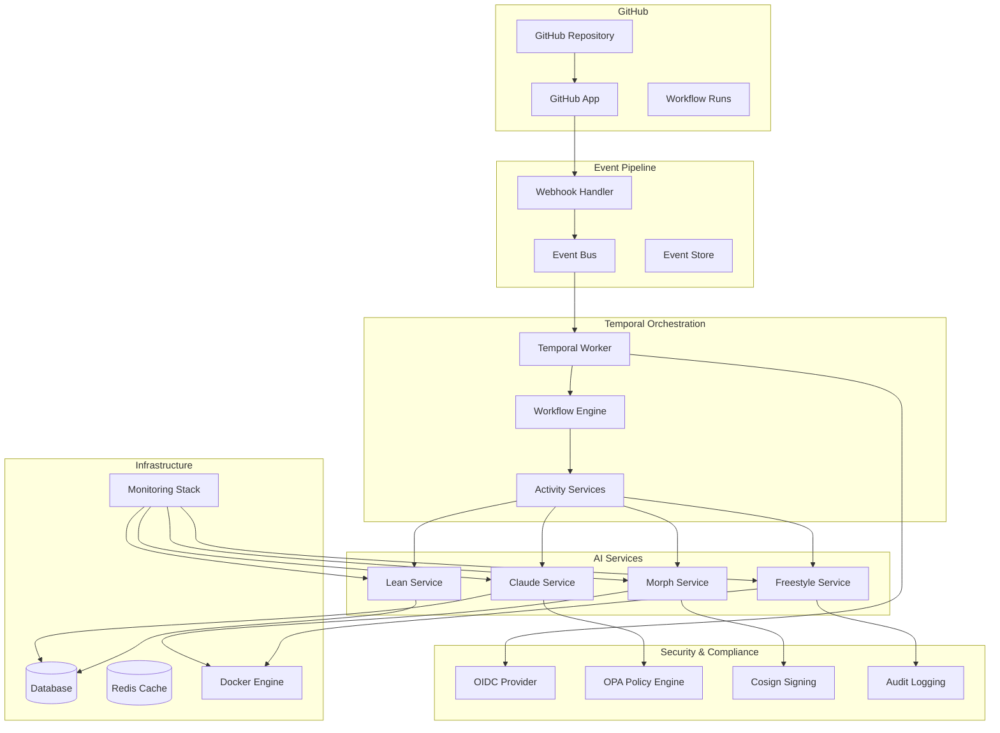
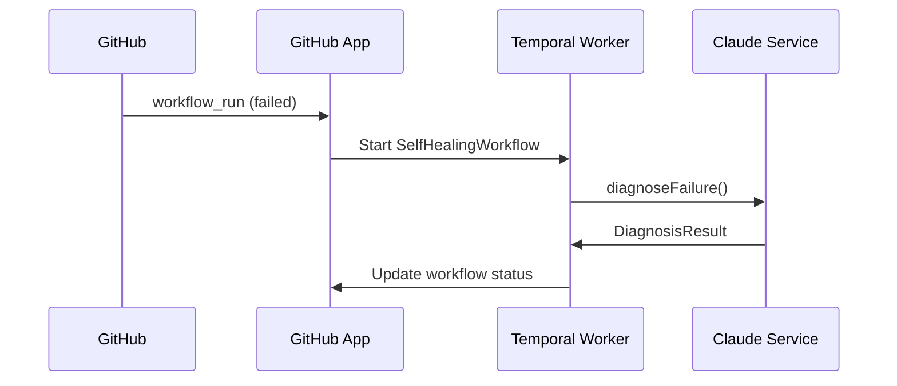
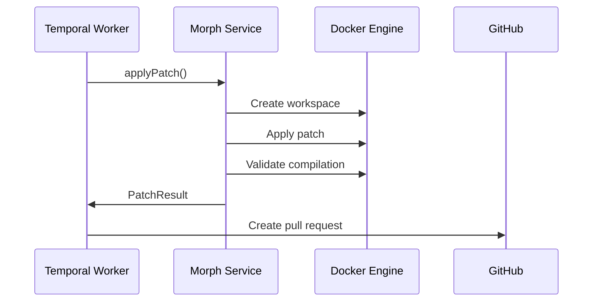
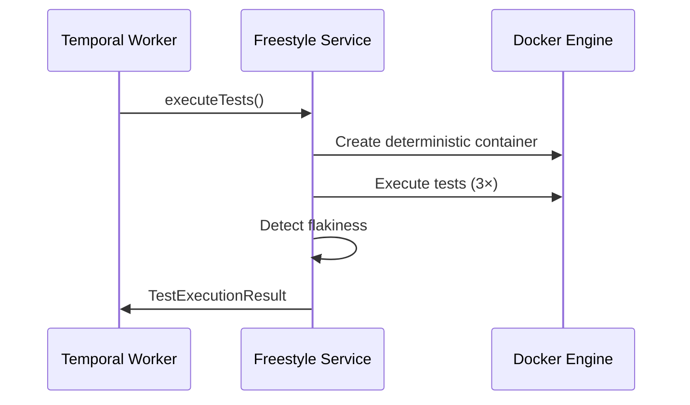
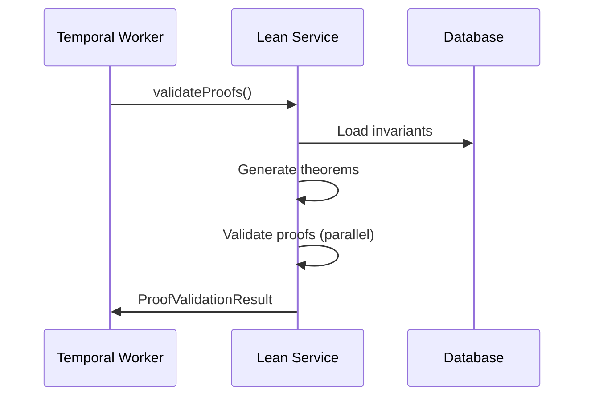
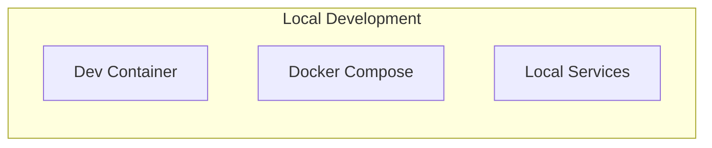
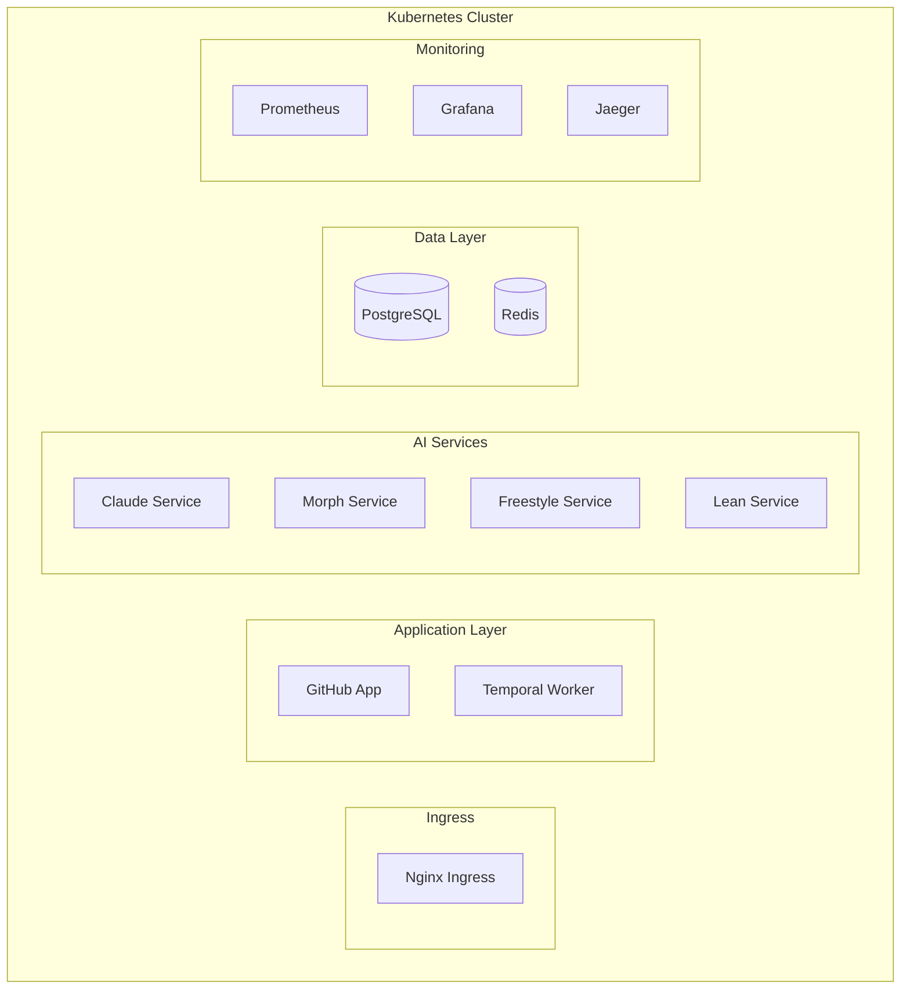

# System Architecture

## Overview

The Self-Healing CI system is a state-of-the-art continuous integration platform that automatically diagnoses, patches, and validates code issues using AI-powered analysis and formal verification. The system follows a microservices architecture with event-driven workflows and comprehensive observability.

## Architecture Diagram

## Core Components

### 1. GitHub App

- **Purpose**: Webhook listener and event processing
- **Responsibilities**:
  - Listen for workflow_run events
  - Validate webhook signatures
  - Transform events into internal format
  - Trigger Temporal workflows

### 2. Temporal Worker

- **Purpose**: Workflow orchestration and state management
- **Responsibilities**:
  - Execute self-healing workflows
  - Manage workflow state and retries
  - Coordinate between AI services
  - Handle error recovery and compensation

### 3. AI Services

#### Claude Service (Phase 2)

- **Purpose**: Enhanced AI diagnosis with structured failure reports
- **Features**:
  - Token budgeting (16k max)
  - Streaming responses
  - Exponential backoff retries
  - Automatic secret redaction
  - Confidence scoring

#### Morph Service (Phase 3)

- **Purpose**: Automated code patching with compilation validation
- **Features**:
  - Multi-language compilation support (TypeScript, Rust, JavaScript)
  - Safety assessment with risk scoring
  - Retry logic with compiler diagnostics
  - Patch validation and rollback

#### Freestyle Service (Phase 4)

- **Purpose**: Deterministic test containers with flakiness detection
- **Features**:
  - Nix-flaked Docker images
  - 3× retry with flakiness signature analysis
  - Execution trace capture
  - Deterministic test environments

#### Lean Service (Phase 5)

- **Purpose**: Formal invariant proofs and theorem validation
- **Features**:
  - Critical invariant encoding
  - Automated theorem proving (2s CPU budget)
  - AI-generated proof terms
  - Proof maintenance and updates

### 4. Infrastructure Services

#### Monitoring Stack

- **Prometheus**: Metrics collection and storage
- **Grafana**: Dashboards and visualization
- **Jaeger**: Distributed tracing
- **OpenTelemetry**: Instrumentation

#### Security Services

- **OIDC Provider**: Short-lived token authentication
- **OPA Policy Engine**: Fine-grained authorization
- **Cosign**: Supply chain attestation
- **Audit Logging**: Complete audit trail

## Data Flow

### 1. Failure Detection

### 2. Patch Application

### 3. Test Execution

### 4. Proof Validation

## Security Architecture

### Authentication

- **OIDC Integration**: All external service calls use short-lived tokens
- **GitHub App**: Signed commits and verified merges
- **Service Mesh**: mTLS between all internal services

### Authorization

- **RBAC**: Role-based access control for all operations
- **Policy Engine**: OPA for fine-grained policy enforcement
- **Audit Logging**: Complete audit trail for all actions

### Supply Chain Security

- **SLSA v1**: Full provenance tracking
- **Cosign**: Image signing and verification
- **SBOM**: Software bill of materials for all dependencies

## Observability

### Metrics

- **MTTR (Mean Time To Recovery)**: Target ≤ 5min p95
- **Diagnosis Accuracy**: Target ≥ 95%
- **Proof Success Rate**: Target ≥ 95%
- **Patch Success Rate**: Target ≥ 90%

### Tracing

- **OpenTelemetry**: Full activity instrumentation
- **Jaeger**: Distributed tracing visualization
- **Correlation IDs**: End-to-end request tracking

### Logging

- **Structured Logging**: JSON format with correlation IDs
- **Log Levels**: DEBUG, INFO, WARN, ERROR
- **Audit Logging**: Security-relevant events
- **PII Redaction**: Automatic sensitive data removal

## Deployment Architecture

### Development Environment

### Production Environment

## Performance Characteristics

### Latency Targets

- **Webhook Processing**: < 100ms
- **Diagnosis**: < 30s
- **Patch Application**: < 60s
- **Test Execution**: < 300s
- **Proof Validation**: < 10s

### Throughput Targets

- **Concurrent Workflows**: 100
- **Parallel Proofs**: 4 per CPU core
- **Container Executions**: 50 concurrent
- **API Requests**: 1000 req/s

### Resource Requirements

- **CPU**: 8 cores minimum
- **Memory**: 16GB minimum
- **Storage**: 100GB SSD
- **Network**: 1Gbps

## Failure Handling

### Retry Strategies

- **Exponential Backoff**: For transient failures
- **Circuit Breaker**: For external service failures
- **Dead Letter Queues**: For unprocessable events
- **Compensation Logic**: For rollback scenarios

### Error Recovery

- **Automatic Rollback**: Failed patches are automatically reverted
- **State Recovery**: Temporal handles workflow state recovery
- **Data Consistency**: Event sourcing ensures data consistency
- **Monitoring Alerts**: Immediate notification of failures

## Compliance & Governance

### SOC 2 Compliance

- **CCF Controls**: Mapped to all system components
- **Access Control**: RBAC with audit logging
- **Change Management**: Automated with approval workflows
- **Incident Response**: Automated detection and response

### Data Protection

- **PII Redaction**: Automatic sensitive data removal
- **Encryption**: Data at rest and in transit
- **Data Retention**: Configurable retention policies
- **Audit Trails**: Complete action logging
